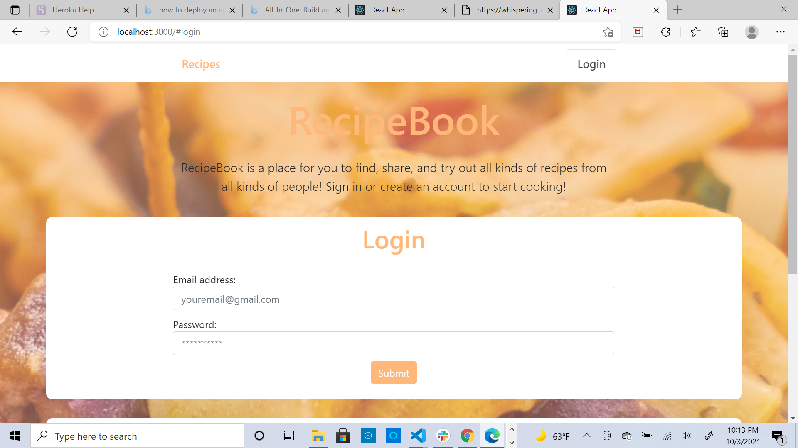

# recipeBook
A place where users can post recipes and share them with the world!

## Description

Blog site that allows publishing of recipes and allows users to edit these blog posts by allowing them to comment on a post or add a reply to a recipe they liked

## Table of Contents

* [Usage](#usage)
* [Technology](#technology)
* [Contributors](#contribuors)
* [Screenshot](#screenshot)
* [Link](#link to application)

## Usage
As mentioned in the descirpiton the usage of this app is ment to be a place where people can post any recpie of their choice and share it with the world. We alos hope that those who reply to the recipes on our applicaiton do so in a manner that is professional and polite. Ultimately we hope our website is used for good and that people can share their love of food.

## Technology
The technology we used was a mongoose database and a restful api for th backend. the specific technologies that were used were Node.js, React, Javascript, HTML, and Insomnia to test the routes once the routes were completed.

## Contributors
Luke and I were given the responsibility of getting the backend up and running which meant we had to do all of the routes that would get the data we needed. Trevon was a master at designing the front end of our application. He has amazing designing skills and is really good at making things appear very nice and orderly. Jacek was our person that connected the front end with the back end as our full stack developer. He has done amazing work on this project. Throughout we were able to come together and work through the majority of our errors.

## Screenshot

## Link to Application
<<<<<<< HEAD
<a href="https://whispering-island-80418.herokuapp.com/">Link to Applicaiton</a>
=======
<a href="https://whispering-island-80418.herokuapp.com/">Link to Applicaiton</a>

>>>>>>> 80b819ab4249186a5d1ad8e621dffac3b308d7a4
